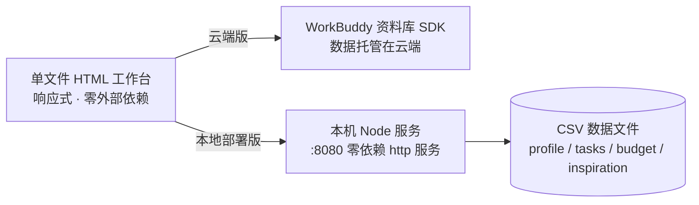

# 悠然 · 装修工作台

> 一个为自装 / 半包家庭打造的轻量级装修全流程管理工具。施工进度、待办清单、预算超支预警、灵感收集，全部收拢进一个单文件网页里——开箱即用，也能跑在你自己的电脑上和家人 / 工长共用。

---

## 为什么做这个

装修是一场长达数月的「信息战」：微信群里的交底记录、便签上的待办、Excel 里的预算，彼此割裂，谁也说不清「现在花超了没有、下一步该谁动手」。

悠然 · 装修工作台把这条关键链路收拢到一处：用八阶段甘特图看进度，用带责任人 / 优先级的清单盯待办，用带刻度标尺的双段进度条盯预算，用灵感库沉淀想落地的风格。无论是自己一个人盯，还是拉上工长、设计师一起协作，都够用。

---

## 核心功能

| 模块 | 能力 |
| --- | --- |
| **首页概览** | 今日待处理、四张关键卡片（进度 / 待办 / 预算 / 灵感）、装修档案速览，一打开就知道今天该干什么。 |
| **施工进度** | 设计 → 拆改 → 水电 → 泥木 → 油漆 → 安装 → 软装 → 完工，八阶段甘特图 + 今日竖线，阶段完成度一目了然。 |
| **待办清单** | 施工小项与日常待办同源管理；支持优先级（P0/P1/P2）、**责任人**、起止日期与逾期提示。 |
| **预算管理** | 按分类 / 阶段双维度汇总；**超支双段进度条**（绿色 = 预算内，红色 = 超支部分），超支明细一键查看。 |
| **灵感库** | 图片本地压缩存储（≤800px、最多 30 张），风格标签自动识别，支持收藏，方便和设计师对齐审美。 |

---

## 两种使用方式

### 方式一：云端版（开箱即用，无需部署）

直接打开公开链接即可使用，数据由 WorkBuddy 资料库托管：

- 体验地址：https://workbuddy.link/p/CjEukCWGZYQYX0robhHTpt

适合想马上试用、不打算自己维护的人。

### 方式二：本地部署版（多人共用 · 数据完全私有）

把工作台跑在你自己的 Mac 上，家人 / 工长连同一个地址就能**共用同一份数据**，不依赖任何云端服务。数据以 CSV 文件存在你电脑里，可直接用 Excel / Numbers 打开。

- 依赖：仅需 Node.js（零三方依赖）
- 启动：
  ```bash
  git clone https://github.com/TerryWanglucky/renovation-workbench.git
  cd renovation-workbench/本地部署
  node server.js
  ```
- 本机访问：浏览器打开 `http://localhost:8080`
- 同一 WiFi 下的家人 / 工长：打开 `http://<你的内网IP>:8080`
- 公网访问（临时）：`cloudflared tunnel --url http://localhost:8080`
- 完整部署 / 备份 / 安全说明见 **[本地部署/README.md](本地部署/README.md)**

---

## 技术架构



- **前端**：单个 `装修工作台.html`，全内联 CSS / JS，响应式，无构建步骤、无 CDN。
- **云端版**：通过资料库 SDK 与在线表格双向读写，离线打开自动降级到 `localStorage`。
- **本地部署版**：零依赖 Node `http` 服务托管页面 + 本地 REST 接口（`/api/:coll`），多人共用同一份 CSV；CSV 手写零依赖解析（正确处理引号 / 逗号 / 换行），原子写入 + 串行写队列避免并发覆盖。

---

## 目录结构

```
renovation-workbench/
├── 装修工作台.html          # 云端版（单文件，资料库托管）
├── 本地部署/
│   ├── 装修工作台.html       # 本地部署版页面副本（数据走本地接口）
│   ├── server.js            # 零依赖 Node 服务 + CSV 存储层
│   ├── README.md            # 部署 / 访问 / 备份 / 安全说明
│   └── *.csv                # 运行时生成的数据文件（已 gitignore）
└── README.md                # 本文件：项目介绍
```

---

## 数据隐私

- 本地部署版的所有数据仅存储在你电脑的 CSV 文件中，**不会上传到任何云端**。
- `本地部署/*.csv`、`data.json`、`node_modules/`、`.ssh/` 等均已加入 `.gitignore`，推送到 GitHub 时**仅包含代码，不含任何个人数据或密钥**。
- 公网隧道链接等于把数据访问权交给了拿到链接的人，请只发给信任的人，用完即关。

---

## 快速开始（本地部署版）

```bash
# 1. 拿到代码
git clone https://github.com/TerryWanglucky/renovation-workbench.git
cd renovation-workbench/本地部署

# 2. 启动（默认 8080，可用 PORT 改端口）
node server.js
# 自定义端口示例：
# PORT=9000 node server.js

# 3. 打开浏览器
# 本机：   http://localhost:8080
# 同 WiFi： http://<你的内网IP>:8080
```

首次启动会自动注入示例数据（含一条逾期示例），可在「数据管理」里清空。删除 `*.csv` 再重启即恢复示例。

---

## 许可

个人项目，代码供学习 / 自用参考。
